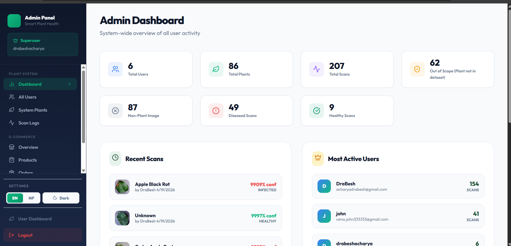
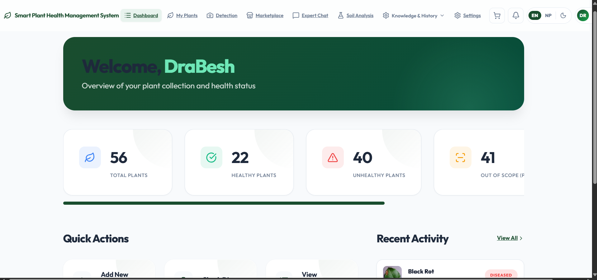
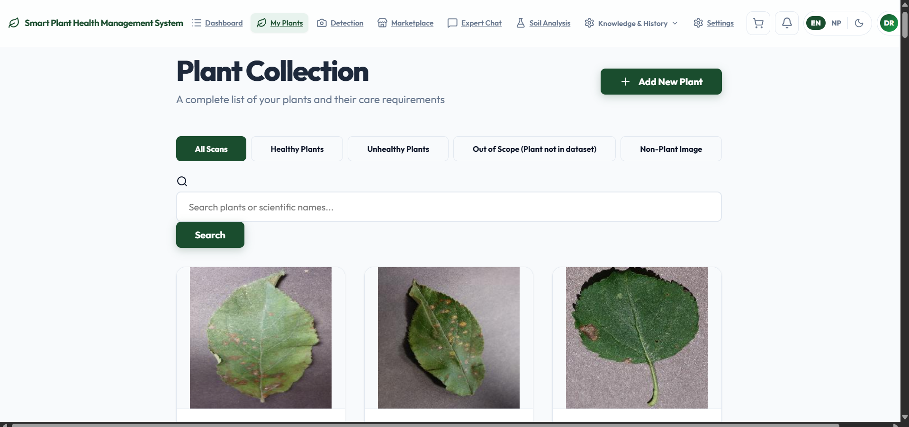
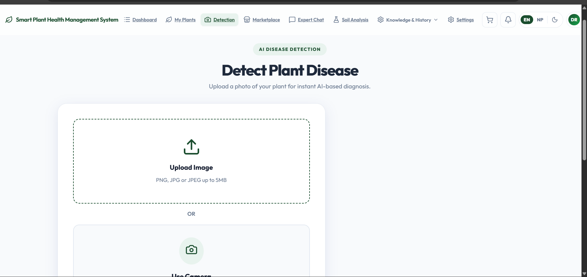
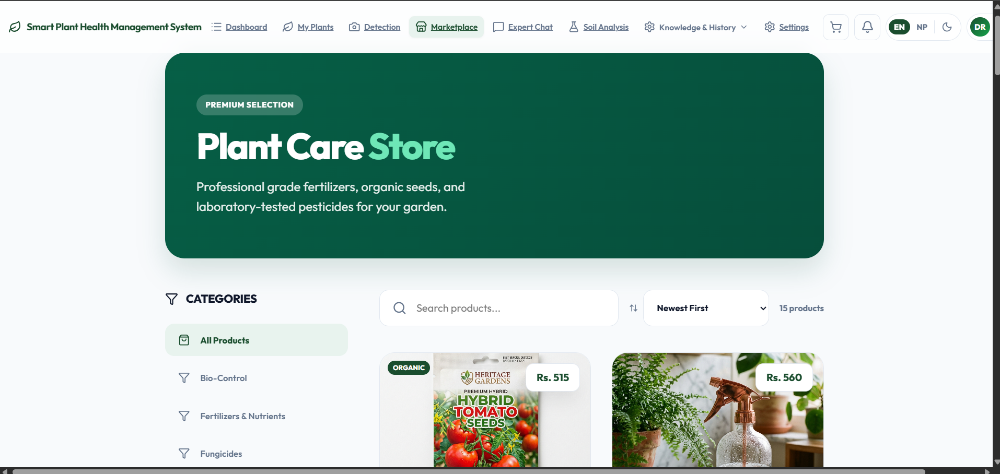

# Smart Plant Health Management System 🌱

**Empowering Farmers with AI-Driven Diagnostics, Soil Analysis, and an Integrated Marketplace.**

---

## 🌟 Project Overviews
The **Smart Plant Health Management System** is a full-stack specialized platform designed to bridge the gap between agricultural diagnostics and treatment procurement. By leveraging AI for disease detection and soil parameter analysis, the system provides deterministic health scores and actionable treatment protocols. It features a seamless transition from diagnosis to an integrated e-commerce marketplace, ensuring farmers have direct access to the exact organic and chemical amendments they need.

## 🎯 Project Objective
The primary goal of this system is to provide a **deterministic, scientific approach** to plant care. It aims to:
- Automate the identification of plant diseases using AI.
- Analyze soil health parameters (NPK, pH, Moisture) against global agronomical standards.
- Streamline the purchase of specialized treatments through an integrated marketplace.
- Provide expert-level agricultural advisory accessible to everyday users.

---

## ✨ Key Features

### 👤 User Authentication & Profile
- **Secure Access**: Role-based access control (RBAC) for Farmers, Experts, and Admins.
- **Profile Management**: Localized settings, language preferences (EN/NP), and address management for seamless checkout.

### 🔬 Intelligent Diagnostics
- **Disease Detection**: AI-powered image analysis to detect pests and diseases.
- **Treatment Protocols**: Detailed, step-by-step organic and chemical treatment guides.
- **Soil Advisor**: Real-time analysis of soil parameters with immediate fertilizer recommendations.

### 🛒 Integrated Marketplace
- **Curated Store**: Specialized fertilizers, pesticides, and tools directly linked to diagnostic results.
- **Advanced Checkout**: Multi-step checkout with coupon validation and multiple payment options.
- **Order Tracking**: Real-time status updates from "Pending" to "Delivered."

### 🛠️ Admin Dashboard
- **Store Management**: Product CRUD, coupon management, and stock alerts.
- **Analytics**: Revenue tracking, order volume trends, and user statistics.
- **Expert Review**: Quality control for user-submitted reviews and AI predictions.

---

## 💻 Technologies Used

### Frontend
- **Framework**: [React](https://reactjs.org/) (Vite)
- **Styling**: Vanilla CSS with Modern Aesthetics (Glassmorphism, Vibrant Palettes)
- **Icons**: [Lucide React](https://lucide.dev/)
- **State Management**: Context API

### Backend
- **Framework**: [Django](https://www.djangoproject.com/) (REST Framework)
- **Security**: JWT Authentication, CORS Headers, Secure Mid-layers
- **Inference**: PyTorch-based Image Recognition
- **Static Hosting**: Whitenoise

### Database
- **Database**: [PostgreSQL](https://www.postgresql.org/) (Production-ready)
- **Version Control**: Git / GitHub

---

## ⚙️ System Requirements

### Hardware
- A modern computer or smartphone with an active internet connection.
- Camera access (for real-time leaf diagnostic image capture).

### Software
- **Node.js**: v18.0 or higher
- **Python**: v3.10 or higher
- **Browser**: Google Chrome (v90+), Firefox (v88+), or Safari.

---

## 🚀 Installation and Setup

### 1. Clone the Repository
```bash
git clone https://github.com/acharya100/drabesh-acharya-smartplanthealthmanagementsystem.git
cd drabesh-acharya-smartplanthealthmanagementsystem
```

### 2. Backend Setup
1. Create a virtual environment and install dependencies:
```bash
cd backend
python -m venv venv
source venv/bin/activate  # Windows: venv\Scripts\activate
pip install -r requirements.txt
```
2. Set up environment variables:
   - Copy `.env.example` to `.env`.
   - Update `DATABASE_URL`, `SECRET_KEY`, and `EMAIL` credentials.
3. Run migrations and start the server:
```bash
python manage.py migrate
python manage.py runserver
```

### 3. Frontend Setup
1. Install node dependencies:
```bash
cd ../frontend
npm install
```
2. Set up environment variables:
   - Copy `.env.example` to `.env`.
   - Update `VITE_API_BASE_URL`.
3. Start the development server:
```bash
npm run dev
```

---

---

## 🖼️ Screenshots

### 🛡️ Admin Dashboard
> System-wide overview showing total users, scans, diseases, and most active users.



---

### 🏠 User Dashboard
> Personalized overview for farmers showing plant health summary and recent activity.



---

### 🌿 Plant Collection
> Full plant collection with filter tabs for Healthy, Unhealthy, Out-of-Scope, and Non-Plant images.



---

### 🔬 Disease Detection (AI)
> Upload interface for AI-powered plant disease diagnosis from leaf images.



---

### 🛒 Marketplace
> Integrated online store for purchasing fertilizers, pesticides, and farming tools.



---


## 🔮 Future Enhancements

- **Real-time Expert Chat**: Integration with WebSockets for live, instantaneous agricultural advice.
- **IoT Integration**: Direct feed from physical soil sensors in the field for live dashboard monitoring and automated NPK data entry.
- **AR Plant Scouting**: Augmented Reality overlays for localized, real-time disease identification directly in the field.
- **Drone-Based Image Processing**: Expansion to accept batch video/image feeds from agricultural drones for macro-scale disease detection across entire acreages.
- **Native Mobile Application**: Deployment of dedicated iOS and Android apps for faster edge AI processing and improved offline capabilities in hyper-remote areas.
- **Expanded Regional Languages**: Addition of localized dialects (e.g., Maithili, Bhojpuri, Tharu) to ensure complete accessibility for all regional farming demographics.

---

## 👨‍💻 Authors
- **Student Name**: [Drabesh Acharya](https://github.com/acharya100)
- **Department**: BSc Hons Computing
- **College**: Itahari International College

---

## ⚖️ License
This project is developed as part of an educational curriculum. All rights reserved. © 2026.
